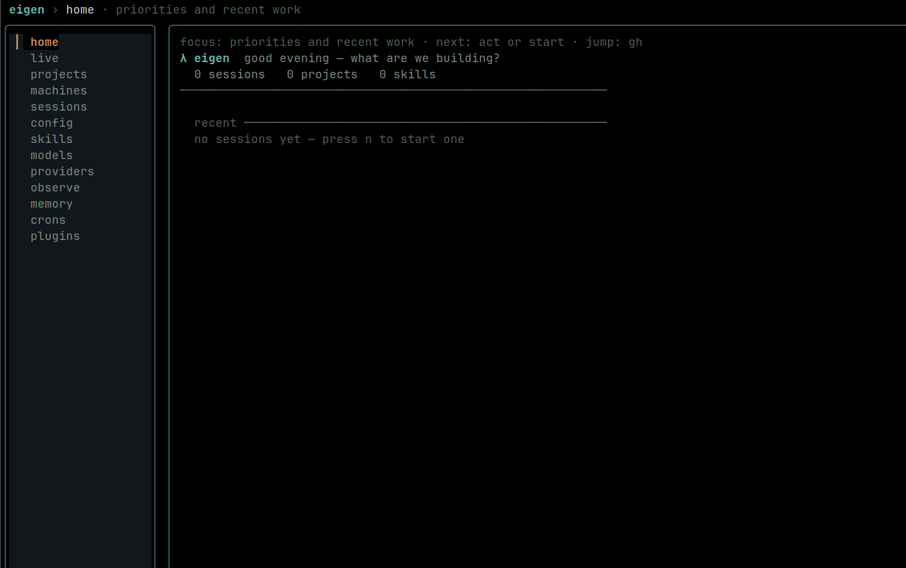
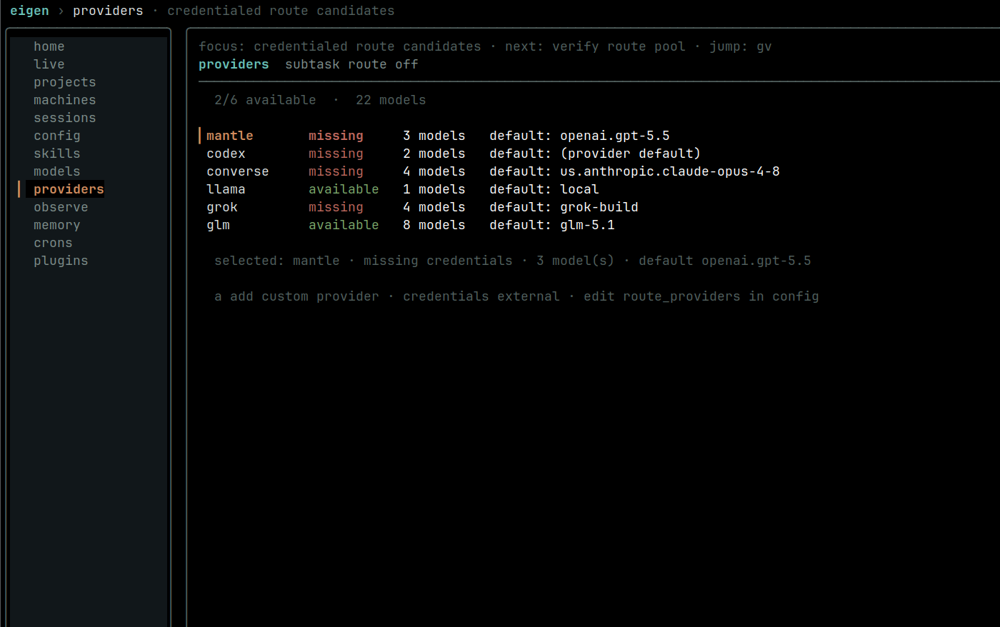
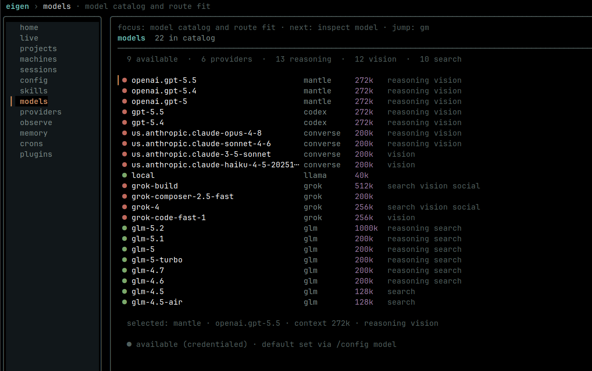

# Eigen

[](https://github.com/avifenesh/eigen/actions/workflows/ci.yml)
[](https://pkg.go.dev/github.com/avifenesh/eigen)

Eigen is a terminal-first coding agent for Go/Linux workstations: a CLI, TUI, daemon, plugin system, and observability dashboard built around long-running local sessions.

Use it when you want a local agent loop you can inspect, resume, route across models, extend with skills/plugins, and keep under normal approval gates instead of a stateless one-shot wrapper.



## What this is (and what it isn't)

Eigen is an **opinionated personal project**. I built it for my own needs, and
it's shaped end to end by how I like to work — not by an attempt to compete with
any particular agent or assistant.

It starts from the CLI, but I wanted it to be **a bit more than a CLI** — a
*home base* I open and live in. So `eigen app` gives it a homepage: a place that
greets me, surfaces what to act on, and lets me jump between everything from one
rail.

The thing I actually wanted was **one agent that holds all my providers in a
single awareness** and lets me move freely between them — Bedrock, hosted
Claude, OpenAI-compatible endpoints, local models — and then **route work
between them**: keep my chosen main model in charge while delegated subtasks get
fed to whatever model fits the job.

On top of that, the features I kept wishing I had, all in one place:

- **Providers in one view** — every credentialed provider/model as a route
  candidate, switchable without hand-editing JSON.
- **Routing** — delegate subtasks to a cheaper/faster/stronger model while the
  main model stays my explicit choice.
- **Memory** — durable project/global notes that carry across sessions, not a
  goldfish that forgets every restart.
- **Dreaming** — background consolidation of memory (the bit I borrowed from how
  I think about Claude-style reflection) so notes get distilled, not just piled
  up.
- **A proactive feed** — the home `act on` list that looks at git/GitHub/memory
  and *gives me ideas and next steps*, instead of waiting for a prompt.
- **Observability** — local telemetry for errors, token/model usage, routes,
  hooks, and subagents, so I can see what the thing actually did.

I want it to feel like **one coherent whole** — something that can think a
little *with* me and hand me a starting point — not just a wrapper that shells
out to a model.

So, to be upfront:

- It's **built for me first.** Defaults, tradeoffs, and priorities reflect my
  workflow (terminal-first, Linux, local-first).
- It's **shared in case it's useful.** If you find it good and it makes you
  happy, wonderful — use it, fork it, take ideas from it.
- It's **not a competitor pitch.** I'm not claiming to be better than anything
  else; I just built what I needed and decided to make it public.
- **No promises of support or stability.** Expect opinionated choices and
  occasional churn. Issues and PRs are welcome (see below), but the roadmap
  follows what I need.

If that sounds like your kind of tool, great. If not, that's completely fine.

### A look around

Your providers, side by side — Bedrock, hosted Claude, OpenAI-compatible, and
local endpoints as switchable route candidates:



The model catalog with route fit — context windows, capability tags
(reasoning/vision/search), and which models are credentialed:



## Quick proof signals

- Go module: `github.com/avifenesh/eigen`
- Main verification command: `make gate` (`go build`, `go vet`, `go test ./...`, gofmt check)
- Local-first runtime: daemon socket, transcripts, memory, plugins, and config live under `~/.eigen`
- Safety posture: project-local `.env` files are ignored; credentials are loaded from trusted user config, not from untrusted repos

## Why this project

Use Eigen when you need:

- a persistent coding-agent daemon with resumable sessions;
- a TUI/app surface for live sessions, projects, models, providers, memory, plugins, crons, and observability;
- model routing for delegated work while preserving the user-selected main model;
- plugin/skill/command compatibility with Claude- and Codex-style ecosystems;
- local telemetry for errors, tools, model/token usage, hooks, route decisions, subagents, and runtime health.

## Requirements

Eigen is **Linux-first** and targets local terminal workflows.

Core (always needed):

- **Go** — the toolchain version is pinned in `go.mod`; building/testing Eigen needs only Go.
- **git** — used for provenance/orientation, diffs, worktrees, and memory.
- **ripgrep (`rg`)** — used for search, glob, and retrieval indexing.
- **bash** — used by the shell tool.

Building Eigen itself does **not** require Rust, Node, or any desktop tooling.

Optional, only for the bundled harness capabilities you choose to install (see
[Built-in harness helpers](#built-in-harness-helpers) and
[`internal/harness/embedded/README.md`](internal/harness/embedded/README.md)):

- **Rust/Cargo** — to build the `computer-use-linux` and `agent-workspace-linux` binaries via `eigen harness install`.
- **Node ≥ 18** + **Google Chrome/Chromium** — for the Chrome bridge.
- **Real-desktop computer-use** (`computer_use_*`): `ydotool`, `gnome-screenshot` (or an xdg-desktop-portal screencast), `gdbus`, `gsettings`; per-WM helpers `xprop`/`i3-msg`/`hyprctl` as applicable.
- **Isolated workspace sandbox** (`workspace_*`): `Xvfb`, `xauth`, `xdpyinfo`, `xdotool`, `tmux`, `bwrap`, `setsid`, and `import` (ImageMagick) or `scrot`.

Other features degrade gracefully when their tool is absent: `gh` (GitHub feed),
`systemctl`/`crontab` (scheduling), `wl-paste`/`xclip`/`pngpaste` (clipboard
images), `python3` + `kokoro_onnx` (TTS).

## Installation

Eigen currently builds from source.

```bash
git clone https://github.com/avifenesh/eigen.git
cd eigen
make build
./bin/eigen --help
```

For a user-local install:

```bash
install -Dm755 ./bin/eigen "$HOME/.local/bin/eigen"
eigen --help
```

## Quick start

```bash
# Run one task in the current repo.
eigen "summarize the project layout"

# Open the terminal app dashboard.
eigen app

# Run the full local quality gate before committing.
make gate
```

What happens:

1. `eigen` loads defaults from `~/.eigen/config.json` and credentials from trusted user-level config.
2. Interactive sessions attach to the local daemon unless daemonless mode is requested.
3. Session transcripts, memory, plugin wiring, hooks, and observability data stay local under `~/.eigen`.

## Core concepts

- **Session**: a resumable conversation and tool-use loop.
- **Daemon**: the long-lived local host for sessions (`eigen daemon`), normally reached through a Unix socket.
- **App/TUI**: terminal dashboards for sessions, projects, config, models, providers, observe, memory, plugins, machines, and scheduled jobs.
- **Tools**: file, shell, search, subtask, observe, plugin, and integration capabilities exposed to the model through approval-aware tool calls.
- **Routing**: optional delegated-work routing. The main model remains the explicit user choice; `/route` only affects delegated subtasks.
- **Custom providers**: add OpenAI-compatible chat/responses endpoints or Anthropic-compatible endpoints, each with its own explicit model catalog, from the app Providers page.
- **Memory**: durable project/global notes injected as compact context, with local storage under `~/.eigen/memory`.
- **Plugins**: Claude/Codex-style plugin bundles for skills, commands, MCP servers, hooks, and task roles.

## Feature highlights

- Persistent local daemon with session attach/resume.
- Bundled harness helper sources for Linux Computer Use, isolated agent workspaces, connector-only Chrome bridge, and orientation/provenance history; install them with `eigen harness install` instead of maintaining sibling checkouts or separate helper packages.
- TUI/app pages for live work, projects, sessions, config, models, providers, observability, memory, crons, machines, and plugins.
- Structured observability for tool failures, model/token usage, skills, hooks, subagents, route decisions, and runtime pressure.
- Background subtasks and task groups with route-aware model selection.
- Plugin marketplace support for Claude/Codex-style bundles.
- Custom slash commands from user and project command directories.
- Approval-aware safety model for risky tool actions.

## Configuration

The primary config file is:

```text
~/.eigen/config.json
```

Common fields include provider/model defaults, routing options, permission mode, theme, and provider-specific settings.

Custom provider catalogs live in:

```text
~/.eigen/providers.json
```

The Providers page in `eigen app` can add a provider without hand-editing JSON. Press `a` on the Providers page and define the protocol (`openai` chat/completions, OpenAI `responses`, or `anthropic`), endpoint, API-key environment variable (or leave it blank for an explicit no-auth local endpoint), and the exact model names Eigen should show. Keep credentials in environment variables or trusted user-level config; do not commit `.env`, `.eigen`, token files, custom provider files with inline keys, or generated transcripts.

Example custom provider catalog:

```json
{
  "providers": [
    {
      "name": "localai",
      "type": "openai",
      "api": "chat",
      "base_url": "http://127.0.0.1:11434/v1",
      "no_auth": true,
      "models": [{ "name": "local-qwen", "id": "qwen-wire", "context_window": 128000 }]
    }
  ]
}
```

Useful environment variables:

- `EIGEN_INSTANCE=dev` — use the development daemon/socket namespace.
- `EIGEN_NO_DAEMON=1` — run a foreground daemonless session.
- `EIGEN_THEME=<name>` — select a theme before startup.

## Built-in harness helpers

Eigen's Go binary embeds the source for the optional harness helpers:

- `computer-use-linux` for real desktop computer-use tools (`computer_use_*` MCP group);
- `agent-workspace-linux` for isolated scratch desktop workspaces (`workspace_*` MCP group);
- `orientation`, a native Go provenance/history engine used to answer “why does this code exist?” without a separate skill package or Node runtime;
- `chrome-bridge`, a connector-only Chrome extension/native-host/MCP bridge for acting on the user's already-logged-in Chrome without embedding a chat UI.

They are not required for normal CLI use, and they are **first-party Eigen
components** (same author), not third-party code. Each carries its own MIT
license and an origin/runtime-needs summary lives in
[`internal/harness/embedded/README.md`](internal/harness/embedded/README.md).
To install them intentionally, run:

```bash
eigen harness install
# or one at a time:
eigen orientation install
eigen chrome install
eigen computer-use install
eigen workspace install
```

The install step builds the bundled Rust desktop sources with Cargo, copies helper binaries into `~/.local/bin`, installs the connector-only Chrome bridge under `~/.eigen/chrome-bridge`, writes Chrome/Chromium native-host manifests, initializes the native Go orientation state under `~/.eigen/orientation`, writes a small `orientation` wrapper, and installs Eigen orientation hooks that call that wrapper. Eigen auto-registers installed desktop/Chrome helpers as built-in MCP servers on the next run. This removes the previous requirement for separate `~/projects/computer-use-linux`, `~/projects/agent-workspace-linux`, `~/projects/agent-chrome-bridge`, standalone orientation/get-oriented package checkouts, or a Node-based orientation runtime. After `eigen chrome install`, load the unpacked Chrome extension from the printed `~/.eigen/chrome-bridge/extension` path.

Orientation can also be run through Eigen directly:

```bash
eigen orientation provenance "$PWD" internal/app/app.go
eigen orientation related "$PWD" internal/app/app.go
```

## Development

```bash
make build      # compile ./bin/eigen
make test       # go test ./...
make vet        # go vet ./...
make gate       # build + vet + test + gofmt check
make race       # focused race tests for daemon/agent packages
make harness    # optional: install bundled orientation/chrome/computer-use/workspace helpers
```

Before opening a PR, run:

```bash
make gate
```

## Limitations / tradeoffs

- Eigen is currently optimized for local Linux terminal workflows.
- Provider credentials and model access are user-supplied; the repo does not include hosted model access.
- Some app pages reflect local machine state (`~/.eigen`, systemd user timers, SSH config) and may show less data on a fresh install.
- Remote control is intentionally constrained; raw unauthenticated daemon networking is not a goal.

## Docs

- [Plugins and marketplaces](docs/plugins.md)
- [Memory system plan](docs/memory-system.md)
- [Roadmap](ROADMAP.md)
- [Contributing](CONTRIBUTING.md)
- [Code of conduct](CODE_OF_CONDUCT.md)
- [Security policy](SECURITY.md)

## Contributing

Bug reports, focused fixes, tests, and documentation improvements are welcome. Start with [CONTRIBUTING.md](CONTRIBUTING.md), run `make gate`, and keep credentials or local runtime artifacts out of commits.

## License

MIT. See [LICENSE](LICENSE).
