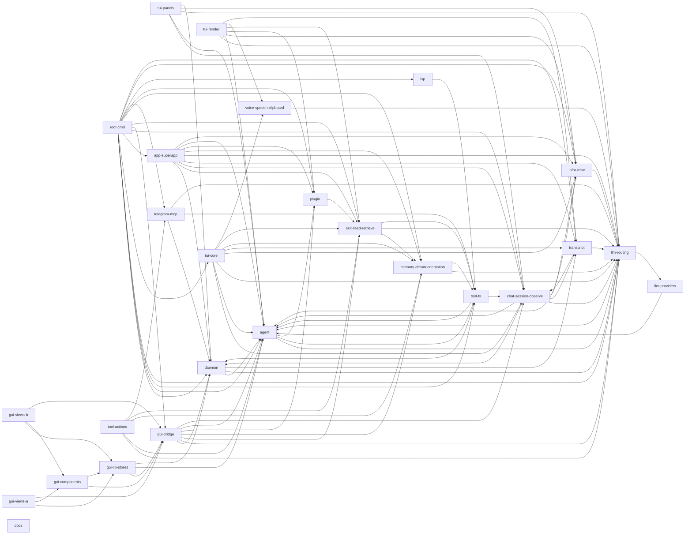

# Eigen Code Map

**Eigen** is a terminal-first, multi-vendor AI coding agent. A single `eigen` binary runs a long-lived
daemon that hosts durable agent sessions, drives a tool-use loop across many LLM providers (Anthropic,
Bedrock, Codex, Grok, GLM, llama, custom) behind a quality-tier auto-router, and surfaces those sessions
through three front-ends: a Bubble Tea terminal chat UI, a terminal "superapp" dashboard, and a Wails v3 +
Svelte 5 desktop GUI. Around that core sit subsystems for tools (filesystem/search/agentic), memory and
dream-style consolidation, plugins/skills, MCP, LSP, voice/speech/clipboard, and a Telegram bridge.

**How to use this map.** Each row links to a per-area sub-file that documents that area's files, entry
points, and dependencies. Start from the section that matches your task (Core runtime, LLM, Terminal UI,
Desktop GUI, Tools, or Subsystems), follow the link, and use the [Dependency graph](#dependency-graph) to
see what an area pulls in. The [Key entrypoints](#key-entrypoints) list is the fastest way to find where
execution begins. Suspected dead code is collected separately in [`_dead-code.md`](_dead-code.md).

---

## Core runtime

| Area | What it covers | Files | Link |
| --- | --- | --- | --- |
| root-cmd | The eigen binary's package main: CLI flag parsing and subcommand dispatch, the daemon session host, per-session agent wiring, the cross-vendor model router, SSH-remote/attach paths, and the Wails desktop GUI launcher. | 16 | [root-cmd](root-cmd.md) |
| daemon | The long-lived unix-socket session host: owns durable agent sessions, serves views (TUI/GUI/Telegram/remote) over line-JSON, and persists/resurrects sessions across daemon restarts. | 9 | [daemon](daemon.md) |
| agent | The tool-use loop plus eigen's full multi-agent layer: live-config sessions, auto-compaction, foreground/background subtask delegation, parallel read-only and worktree-isolated mutating fan-out, goal judging, named roles, and a durable cross-process task store. | 9 | [agent](agent.md) |
| chat-session-observe | The chat Backend seam (one interface for local in-process vs daemon-remote conversations), the on-disk session store/index/titler across all transcript sources, and the metadata-only append-only observability log + summarizer. | 8 | [chat-session-observe](chat-session-observe.md) |
| transcript | Cross-tool transcript readers that normalize Claude Code, Codex, Pi, Hermes, OpenCode, and eigen-native session files into a single `[]llm.Message` for resume, plus eigen's durable JSONL save/meta-sidecar/cheap-peek layer. | 8 | [transcript](transcript.md) |

## LLM

| Area | What it covers | Files | Link |
| --- | --- | --- | --- |
| llm-routing | The provider-neutral brain of internal/llm: chat contract, model catalog, quality-tier auto-router, credential-aware candidates, token-budget/compaction/shedding, and cross-vendor review + adversarial planning council (plus embeddings, image gen, and model discovery). | 18 | [llm-routing](llm-routing.md) |
| llm-providers | LLM provider backends (Anthropic, Bedrock Converse/mantle, Codex, Grok, GLM, llama, custom) and the shared retrying HTTP + SigV4 transport behind eigen's neutral `llm.Provider` contract. | 12 | [llm-providers](llm-providers.md) |

## Terminal UI

| Area | What it covers | Files | Link |
| --- | --- | --- | --- |
| tui-core | The Bubble Tea core loop, model state, agent-event-to-block translation, and screen geometry/chrome (layout, hit-testing, input box, rails, sidebar, header, overlay, palette, surface painting, tables) for Eigen's terminal chat UI. | 16 | [tui-core](tui-core.md) |
| tui-render | The presentation-and-interaction layer of eigen's Bubble Tea TUI: transcript rendering (markdown/code/JSON/diffs), the brand identity (breathing λ), the unified key/click/palette action registry, slash commands, completion, drag-select/resize/drop, voice, and attention pings. | 20 | [tui-render](tui-render.md) |
| tui-panels | The Bubble Tea right-panel tabs (changes/git/term/tasks/observe/goal/shells/notes) plus adjacent chrome — config editor, status bar + plan panel, tray overlay, live config switches, workflow runner, panel toggles, and persisted layout prefs. | 15 | [tui-panels](tui-panels.md) |
| app-superapp | internal/app is Eigen's terminal "superapp" — a single Bubble Tea shell with a page rail and 14 dashboard pages (home, live, projects, machines, sessions, config, skills, models, providers, observe, memory, crons, plugins, profile) that gathers an exit intent (open/resume/attach/remote) for main to act on. | 21 | [app-superapp](app-superapp.md) |

## Desktop GUI

| Area | What it covers | Files | Link |
| --- | --- | --- | --- |
| gui-bridge | The internal/gui package is the Go side of the Eigen desktop GUI: a single Wails v3 service (`*Bridge`) whose methods become TS bindings, bridging the Svelte frontend to the daemon (control client + per-session streaming pumps) and to local on-disk state (memory, skills, plugins, connectors, MCP wiring, Google, config, crons, agents, remote). | 18 | [gui-bridge](gui-bridge.md) |
| gui-views-a | The eight top-level route pages of the Eigen desktop GUI (Home, Chat, Live, Sessions, Machines, Observe, Routing, Crons) — Svelte 5 components mounted by App.svelte that orchestrate Bridge RPCs, push-event streams, and shared rune stores into UI. | 8 | [gui-views-a](gui-views-a.md) |
| gui-views-b | The data + control half of the Eigen desktop GUI's view layer — seven Svelte 5 full-page routes (Memory, Dreaming, Skills, Agents, Plugins, Profile, Config) that load DTOs via the Bridge facade and round-trip mutations back to the Go backend. | 7 | [gui-views-b](gui-views-b.md) |
| gui-components | The reusable Svelte 5 building blocks of the Eigen desktop GUI — primitives (Badge, Button, Card, StatusDot, EmptyState), overlay/chrome (Rail, TopBar, Sheet, Popover, Tooltip, ToastHost, CommandPalette, Shortcuts), and content renderers (Markdown, CodeBlock, DiffView, ToolCallCard, VirtualList). | 19 | [gui-components](gui-components.md) |
| gui-lib-stores | The TypeScript glue layer of the Wails+Svelte GUI: a typed Bridge facade over the generated Go bindings, DTO type mirrors, a Wails event wrapper, a hash router, and the runes-based singleton stores (daemon, sessions, feed, toasts, clock) plus a per-session streaming transcript factory. | 14 | [gui-lib-stores](gui-lib-stores.md) |

## Tools

| Area | What it covers | Files | Link |
| --- | --- | --- | --- |
| tool-fs | The agent's filesystem hands: read/list/glob/tree exploration, write/edit/multiedit/patch/move mutations, git diff, and bash with backgrounded-shell control — every path fenced through `Policy.Resolve`. | 13 | [tool-fs](tool-fs.md) |
| tool-actions | The tool contract + registry plus Eigen's search/discovery, network, and agentic/meta tools (task fan-out, cross-vendor plan/review, goal/todo/memory/skill, image-gen) — thin Definition constructors with their heavy backends injected from main.go/build.go. | 18 | [tool-actions](tool-actions.md) |
| lsp | A minimal JSON-RPC LSP client that maps files to language servers by extension and exposes definition/references/hover/symbols/diagnostics as read-only eigen tools. | 5 | [lsp](lsp.md) |

## Subsystems

| Area | What it covers | Files | Link |
| --- | --- | --- | --- |
| memory-dream-orientation | Eigen's long-term knowledge layer: tiered per-scope memory store + SQLite index/job-queue (memory), the model-driven reflection/consolidation/summarization prompts (dream), and a native session-history provenance engine (orientation). | 10 | [memory-dream-orientation](memory-dream-orientation.md) |
| skill-feed-retrieve | Three independent knowledge-and-nudge packages: skill/ (discover, load, install, security-scan, propose SKILL.md), feed/ (proactive one-keystroke action feed over git/memory/GitHub/model-suggest), and retrieve/ (per-project on-demand BM25+cosine RRF context retrieval). | 11 | [skill-feed-retrieve](skill-feed-retrieve.md) |
| plugin | Eigen's plugin + marketplace layer: fetches Claude/Codex plugin bundles, discovers their components by convention, security-scans them, and wires skills/agents/commands/MCP servers/hooks into the shared ~/.eigen config with reversible install bookkeeping. | 6 | [plugin](plugin.md) |
| telegram-mcp | The MCP client over stdio + remote Streamable HTTP (wraps server tools as native Eigen tools with lazy connect, allowlists, a typed mcp.json editor, and built-in helper auto-detection); `internal/connector` adds OAuth 2.1 + PKCE for remote connectors (Notion/Linear/…) with keychain-stored tokens; `internal/google` adds native Calendar/Gmail (direct REST, BYO Google Cloud client, loopback OAuth) as the first step of absorbing atrium; plus the Telegram bridge exposing live daemon sessions on your phone with streaming replies and inline approval buttons. | 22 | [telegram-mcp](telegram-mcp.md) |
| voice-speech-clipboard | Best-effort local-IO peripherals for eigen's terminal chat: microphone STT (VAD + whisper.cpp), read-aloud and conversation-mode TTS (Kokoro/espeak), and system clipboard text/image copy-paste — all env-overridable and self-disabling, consumed only by the TUI. | 9 | [voice-speech-clipboard](voice-speech-clipboard.md) |
| infra-misc | Cross-cutting infrastructure: the theme/color/icon system, optional config + .env loading, custom slash commands, replayable workflows, lifecycle hooks, the bundled-helper/orientation installers, and the shared fuzzy ranker. | 14 | [infra-misc](infra-misc.md) |

## Docs

| Area | What it covers | Files | Link |
| --- | --- | --- | --- |
| docs | Eigen's documentation and project-meta layer: README, roadmap, contributor/security/conduct policies, long-form design + research notes, and the build/module config files (Makefile, wails.json, go.mod). | 17 | [docs](docs.md) |

---

## Dependency graph

Edges are `dependsOn` relationships between areas, collapsed to package-level area nodes and deduped.
External libraries (Wails, sqlite) and self-references are omitted for readability.

---

## Key entrypoints

The ~10 places execution actually begins, in rough boot order:

- **`main.go:main`** (root-cmd) — CLI flag parse + subcommand dispatch; the binary's front door.
- **`daemon.go:runDaemon` / `daemon.go:ensureDaemon`** (root-cmd) — start (or auto-spawn) the long-lived session host.
- **`internal/daemon/server.go:Listen` + `Serve`** (daemon) — accept unix-socket clients and serve line-JSON sessions.
- **`internal/daemon/host.go:NewPersistentHost`** (daemon) — own and resurrect durable agent sessions across restarts.
- **`build.go:buildSession`** (root-cmd) — wire one agent session (provider, router, tools, memory, hooks).
- **`internal/agent/agent.go:(*Session).Send`** (agent) — the core tool-use loop every conversation runs through.
- **`internal/llm/router.go:Route`** + **`candidates.go:RouteCandidates`** (llm-routing) — pick a model by quality tier and credentials.
- **`internal/llm/provider.go:New`** (llm-providers) — construct a vendor backend behind the neutral `Provider` contract.
- **`tui.go:Run`** (tui-core) — boot the Bubble Tea terminal chat UI; **`internal/app/app.go:Run`** (app-superapp) boots the dashboard.
- **`main_gui_wails.go:buildGUIApp`** + **`internal/gui/bridge.go:Bridge`** (gui-bridge) — launch the Wails desktop app and expose Go methods as TS bindings.

---

*Suspected dead / vestigial code across all areas is catalogued in [`_dead-code.md`](_dead-code.md).*
